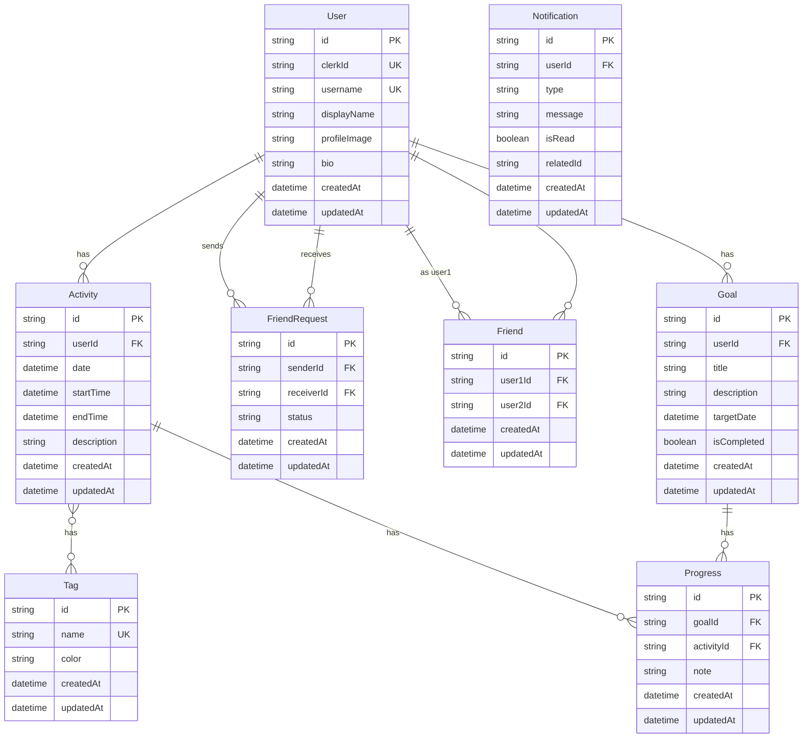

## エンティティ関連図

## モデルの詳細

### User (ユーザー)
- **目的**: ユーザー情報の管理
- **主要フィールド**:
  - `id`: プライマリキー
  - `clerkId`: Clerk認証サービスとの連携用ID
  - `username`: ユニークなユーザー名
  - `displayName`: 表示名
  - `profileImage`: プロフィール画像URL
  - `bio`: 自己紹介文

### Activity (活動)
- **目的**: ユーザーの活動記録
- **主要フィールド**:
  - `userId`: 活動所有者のID
  - `date`: 活動日付
  - `startTime`: 開始時間
  - `endTime`: 終了時間
  - `description`: 活動の説明

### Tag (タグ)
- **目的**: 活動の分類
- **主要フィールド**:
  - `name`: タグ名
  - `color`: UI表示用の色

### FriendRequest (友達リクエスト)
- **目的**: 友達申請の管理
- **主要フィールド**:
  - `senderId`: リクエスト送信者ID
  - `receiverId`: リクエスト受信者ID
  - `status`: リクエストのステータス ("pending", "accepted", "rejected")

### Friend (友達関係)
- **目的**: 確立された友達関係の管理
- **主要フィールド**:
  - `user1Id`: ユーザー1のID
  - `user2Id`: ユーザー2のID
- **注記**: ユーザーID順で格納し、重複を防止

### Goal (目標)
- **目的**: ユーザーの目標管理
- **主要フィールド**:
  - `userId`: 目標所有者のID
  - `title`: 目標タイトル
  - `description`: 目標の説明
  - `targetDate`: 目標達成予定日
  - `isCompleted`: 完了状態

### Progress (進捗)
- **目的**: 目標に対する進捗記録
- **主要フィールド**:
  - `goalId`: 関連する目標ID
  - `activityId`: 関連する活動ID
  - `note`: 進捗に関するメモ

### Notification (通知)
- **目的**: ユーザーへの通知管理
- **主要フィールド**:
  - `userId`: 通知受信者ID
  - `type`: 通知タイプ
  - `message`: 通知メッセージ
  - `isRead`: 既読状態
  - `relatedId`: 関連するエンティティID