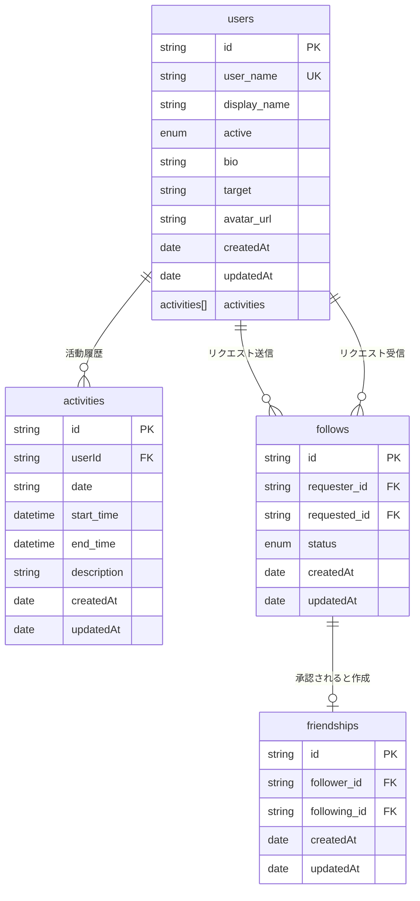

```mermaid
erDiagram
    users ||--o{ activities : "活動履歴"
    
    users ||--o{ follows : "リクエスト送信"
    users ||--o{ follows : "リクエスト受信"
    
    follows ||--o| friendships : "承認されると作成"

    
    users {
        string id PK
        string user_name UK
        string display_name
        enum active
        string bio
        string target
        string avatar_url
        date createdAt
        date updatedAt
        activities[] activities
    }
    activities {
        string id PK
        string userId FK
        string date
        datetime start_time
        datetime end_time
        string description
        date createdAt
        date updatedAt
    }
    follows {
        string id PK
        string requester_id FK
        string requested_id FK
        enum status
        date createdAt
        date updatedAt
    }
    friendships {
        string id PK
        string follower_id FK
        string following_id FK
        date createdAt
        date updatedAt
    }
```
