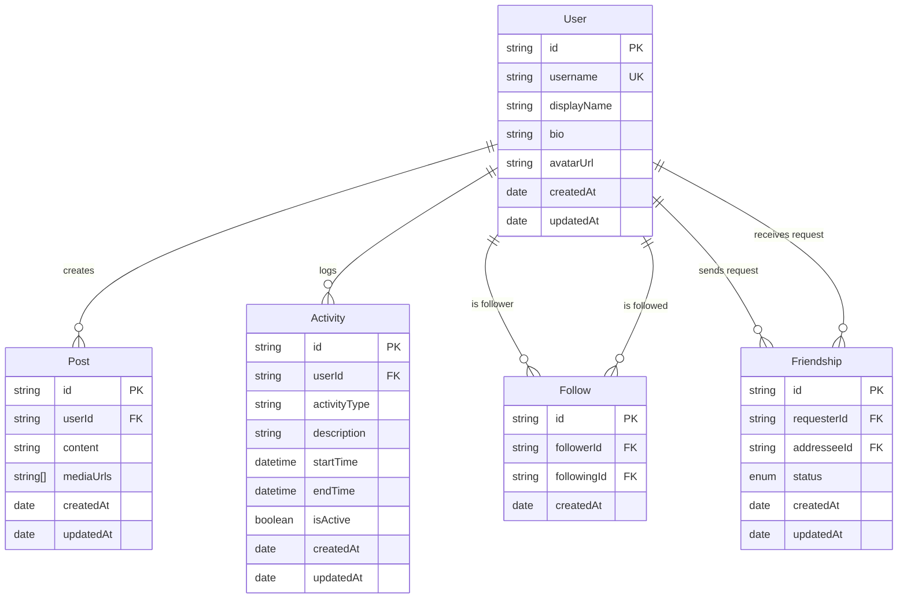

```mermaid
erDiagram
    User ||--o{ Post : creates
    User ||--o{ Activity : logs
    
    User ||--o{ Follow : "is follower"
    User ||--o{ Follow : "is followed"
    
    User ||--o{ Friendship : "sends request"
    User ||--o{ Friendship : "receives request"
    
    User {
        string id PK
        string username UK
        string displayName
        string bio
        string avatarUrl
        date createdAt
        date updatedAt
    }
    
    Post {
        string id PK
        string userId FK
        string content
        string[] mediaUrls
        date createdAt
        date updatedAt
    }
    
    Activity {
        string id PK
        string userId FK
        string activityType
        string description
        datetime startTime
        datetime endTime
        boolean isActive
        date createdAt
        date updatedAt
    }
    
    Follow {
        string id PK
        string followerId FK
        string followingId FK
        date createdAt
    }
    
    Friendship {
        string id PK
        string requesterId FK
        string addresseeId FK
        enum status
        date createdAt
        date updatedAt
    }
```
